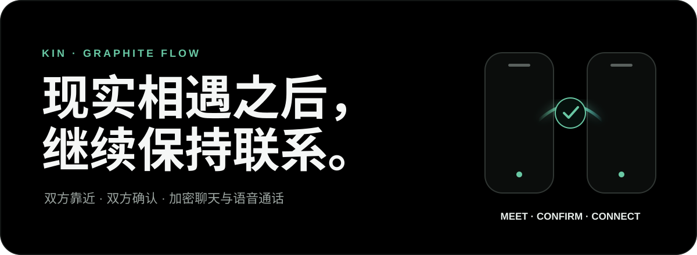
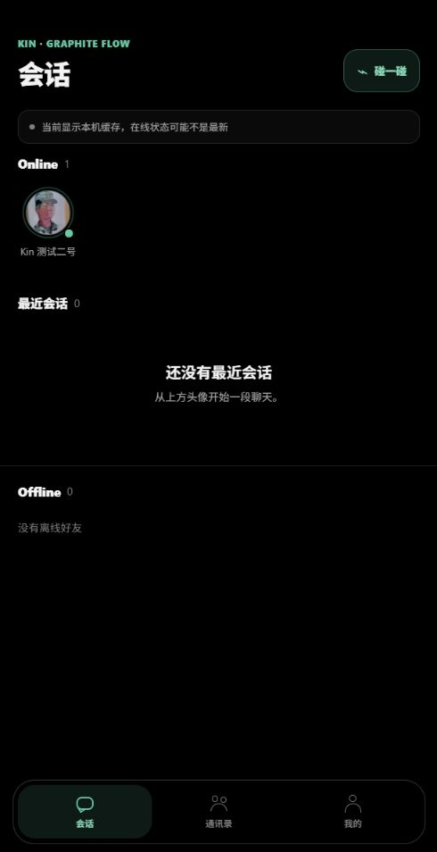
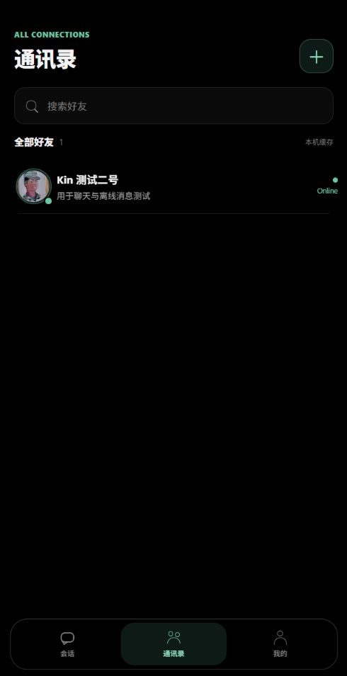
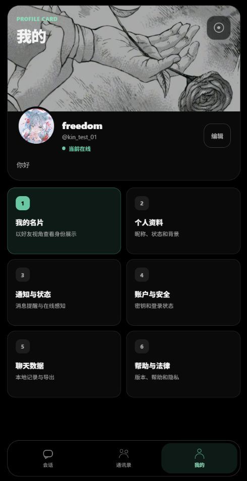
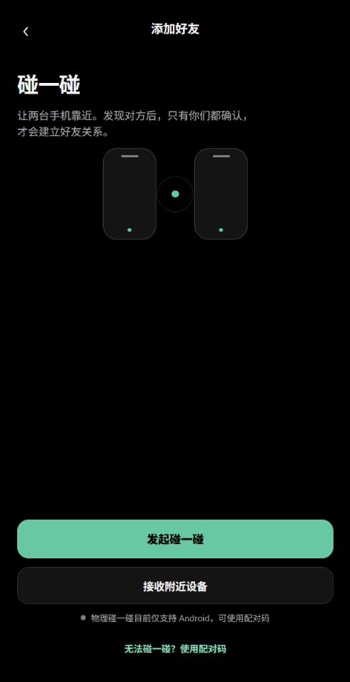
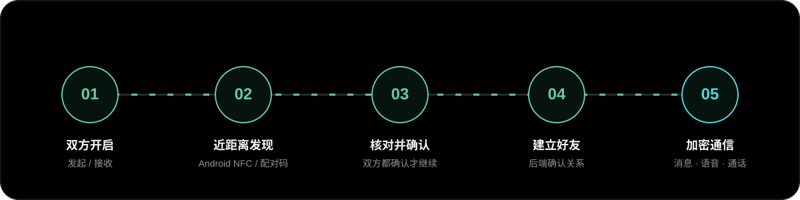

<p align="center">
  
</p>

<p align="center">
  
</p>

<p align="center">
  <strong>Kin 是一款以现实相遇为起点的私密通讯实验。</strong><br />
  两台设备靠近、双方核对并确认后，才建立好友关系；随后可以进行端到端加密聊天、语音消息与 WebRTC 语音通话。
</p>

<p align="center">
  
  
  
  
</p>

## 当前界面

以下截图直接来自当前 Kin 前端预览，不使用旧版设计稿或历史 Bug 截图。

<table>
  <tr>
    <td align="center"><br /><sub>会话 · 在线状态与最近会话</sub></td>
    <td align="center"><br /><sub>通讯录 · 本地好友与在线状态</sub></td>
  </tr>
  <tr>
    <td align="center"><br /><sub>我的 · 名片、资料与独立设置入口</sub></td>
    <td align="center"><br /><sub>碰一碰 · NFC 与配对码降级路径</sub></td>
  </tr>
</table>

## Kin 在做什么

Kin 不把“发现更多陌生人”作为目标。它把好友关系拆成一个可验证的过程：现实中靠近、看到对方资料、双方分别确认，最后才允许建立连接。

| 能力 | 当前实现 |
| --- | --- |
| 碰一碰加好友 | Android HCE 发起 + IsoDep Reader Mode 接收；NFC 不可用时可使用临时配对码 |
| 双方确认 | 发现对方后显示头像、昵称、用户名和名片背景；双方都确认后后端才建立好友关系 |
| 加密聊天 | 使用 TweetNaCl `box`；客户端持有私钥，服务端转发密文并支持有限期离线投递 |
| 语音消息 | 基于 `expo-audio` 录制与播放，本地 SQLite 保存会话数据 |
| 语音通话 | 基于 `react-native-webrtc`；后端只负责 WebRTC 信令和通话状态协调 |
| 本地数据 | SQLite 保存聊天记录，SecureStore 保存敏感凭据，支持聊天数据导出与导入 |
| Graphite Flow | 全局纯黑背景，Kin Green 用于在线状态、确认动作与连接轨迹 |

## 从碰一碰到加密通信

<p align="center">
  
</p>

1. 一台 Android 手机点击“发起碰一碰”，另一台点击“接收附近设备”。
2. 两台设备的 NFC 天线区域靠近；NFC 只传递短期配对凭证，不传输密码、私钥或聊天记录。
3. 双方分别核对对方名片并确认。任何一方取消、超时或不确认，都不会成为好友。
4. 建立好友关系后，双方交换用于加密的公钥。发送方使用自己的私钥和接收方公钥加密，接收方使用自己的私钥和发送方公钥解密。
5. 消息密文和 WebRTC 信令会经过 FastAPI 后端；私钥不上传，服务端不负责解密消息内容。

## 最短启动方式

### 1. 启动后端

```powershell
python -m pip install -r backend/requirements.txt
python -m uvicorn main:app --app-dir backend --host 0.0.0.0 --port 8000
```

健康检查：`http://127.0.0.1:8000/api/health`

### 2. 启动 Development Client

```powershell
cd mobile
npm install
npx expo start --dev-client --lan --port 4182
```

Development APK 需要 Metro 提供 JavaScript Bundle；Metro 与 FastAPI 后端是两个独立进程，都需要保持运行。

### 3. 配置真机后端地址

在 `mobile/.env.local` 中使用电脑当前 Wi-Fi IPv4，而不是手机自己的 `127.0.0.1`：

```env
EXPO_PUBLIC_KIN_API_BASE=http://192.168.1.20:8000
```

修改会被写入构建产物的环境配置后，需要重新构建 APK。手机、电脑和第二台测试手机应连接同一局域网，并确保 Windows 防火墙允许 Python/Uvicorn 在专用网络通信。

## 双设备验收

推荐使用两台 Android 真机，并安装同一版本的 Development APK：

1. 分别登录两个测试账号，确认双方 Online、头像与名片资料一致。
2. 测试 HCE 发起 / Reader 接收，并交换两台设备的角色重复一次。
3. 验证双方确认前不会成为好友；确认完成后通讯录仅新增一次。
4. 互发短文本、长文本、表情和语音消息，检查送达、已读、离线恢复与本地记录。
5. 测试呼叫、来电头像、接听、拒绝、活动通话卡片、静音、扬声器、挂断和网络恢复。
6. 检查 Android 桌面和应用抽屉中的自适应图标，确认不同蒙版不会裁掉人物主体。

完整步骤和设备记录表见 [`codex/kin-two-device-testing.md`](codex/kin-two-device-testing.md)。

## 技术架构

```text
Android / Web Preview
├─ React Native 0.86 + Expo SDK 57
├─ React Navigation
├─ SQLite / SecureStore
├─ TweetNaCl box
├─ expo-audio
├─ react-native-webrtc
└─ Android NFC: HCE + IsoDep Reader Mode
          │
          ├─ REST: 认证、资料、好友、配对、Push 注册
          └─ WebSocket: 在线状态、密文消息、离线同步、通话信令
          │
FastAPI Backend
├─ JWT + bcrypt
├─ SQLAlchemy Core + SQLite
├─ 配对会话与双方确认状态机
├─ 有限期离线密文投递
└─ WebRTC 信令与忙线状态协调
```

```text
Kin/
├─ backend/                 FastAPI、数据库、配对、消息与通话信令
├─ mobile/                  Expo / React Native 应用与 Android 原生模块
├─ codex/                   设计决策和双设备验收文档
├─ assets/readme/           README Hero、流程图与当前产品截图
└─ README.md
```

## 当前状态与边界

- 项目处于开发与双机验收阶段，不代表已完成生产环境安全审计或应用商店发布。
- 物理碰一碰当前以 Android 为主要目标。发起方需要 HCE，接收方需要 NFC Reader Mode；iOS 和不支持 HCE 的设备使用配对码降级。
- Web 预览用于界面和普通业务检查，不能代替 NFC、系统通知、麦克风、音频路由和 WebRTC 真机验收。
- 当前 WebRTC 配置没有部署 TURN。复杂 NAT、公司网络、校园网或跨运营商环境可能无法建立稳定媒体连接。
- 消息内容以密文形式经过后端，并支持有限期离线投递；这不等同于“服务端完全不接触任何消息数据”。
- 仓库当前没有 `LICENSE` 文件，因此未声明开源许可证。

## 验证命令

```powershell
cd mobile
npx tsc --noEmit
Get-ChildItem scripts/check_*.mjs | ForEach-Object { node $_.FullName }

cd ..
python -m unittest discover -s backend/tests -v
```

<p align="center">
  <strong>Kin</strong><br />
  <sub>Meet nearby. Confirm together. Keep the connection private.</sub>
</p>
